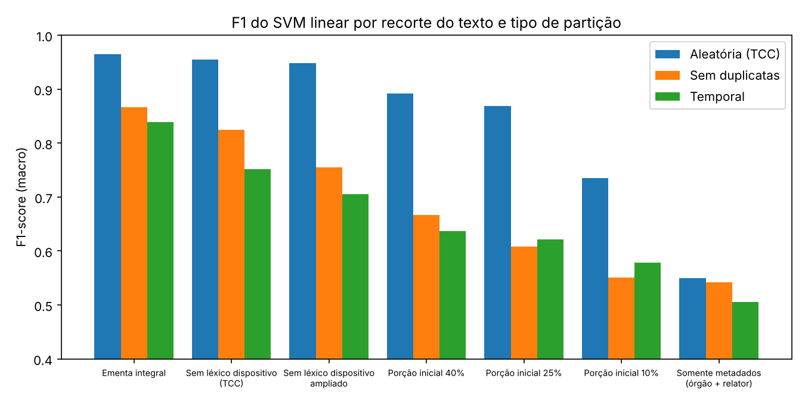
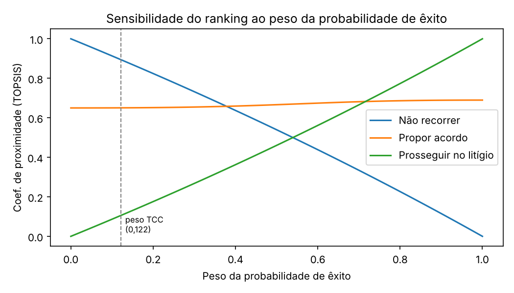
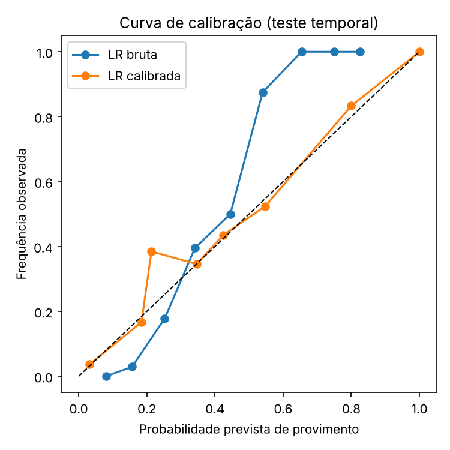

# Validação do TCC — Jurimetria preditiva e análise multicritério

Código que reproduz e testa os resultados do TCC *"Jurimetria preditiva e
análise multicritério no suporte à decisão jurídica estratégica"*
(João Pedro Santos, MBA DSA USP/Esalq, 2026).

## Como rodar

```bash
pip install -r requirements.txt     # Python 3.10+
python executar.py                  # ~30 s; baixa o dataset sozinho
```

Saídas: `resultados/resultados.json` e `resultados/figuras/*.png`.

| Arquivo | Conteúdo |
|---|---|
| `dados.py` | download do corpus TJAL (Lage-Freitas et al., 2022), filtro cível binário, limpeza, léxico dispositivo |
| `modelos.py` | TF-IDF (1-2 gramas) + LR / SVM linear / Naive Bayes; partições aleatória, sem duplicatas e temporal; calibração |
| `mcda.py` | AHP (autovetor + RC) e TOPSIS, com análise de sensibilidade dos pesos |
| `provisao.py` | provisão por valor esperado vs. regra binária + backtest |
| `executar.py` | roda tudo |

---

## 1. O que foi CONFIRMADO

| Item do TCC | TCC | Código | Status |
|---|---|---|---|
| Nº de acórdãos cíveis binários | 5.235 | 5.235 | ✅ |
| Taxa de provimento 2ª / 1ª Câmara | 20,7% / 38,2% | 20,7% / 38,2% | ✅ |
| SVM – ementa integral (F1) | 0,966 | 0,965 | ✅ |
| SVM – sem léxico (F1) | 0,965 | 0,955 | ✅ (≈) |
| SVM – porção inicial 40% (F1) | 0,898 | 0,892 | ✅ |
| SVM – porção inicial 25% (F1) | 0,874 | 0,869 | ✅ |
| AUC SVM | 0,986 | 0,987 | ✅ |
| Matriz de confusão (VN/FP/FN/VP) | 732/8/22/285 | 735/5/33/274 | ✅ (≈) |
| Termos do Quadro 4 | inversão, sucumbência, efeitos infringentes, acolhidos… | mesmos termos | ✅ |
| Pesos AHP (custo/tempo/prob.) | 0,648 / 0,230 / 0,122 | 0,648 / 0,230 / 0,122 | ✅ |
| Razão de consistência | 0,003 | 0,0032 | ✅ |
| TOPSIS (0,894 / 0,651 / 0,106) | — | 0,894 / 0,650 / 0,106 | ✅ com matriz reconstruída* |
| Provisão total esperada | 570,8 | 571,0 | ✅ (arredondamento) |
| Provisão binária / Caso 2 / Caso 3 | 595,0 / 28,7 / 48,8 | 595,0 / 28,7 / 48,8 | ✅ |

\* Matriz AHP usada: `[[1,3,5],[1/3,1,2],[1/5,1/2,1]]`. O TCC **não publica a
matriz de decisão do TOPSIS**; o código usa uma reconstrução que gera o mesmo
ranking (Não recorrer: R$ 2 mil, 3 meses, p=0,20 · Acordo: R$ 12 mil, 12 meses,
p=0,60 · Litígio: R$ 30 mil, 34 meses, p=0,78). Troque pelos valores reais em
`executar.py`.

**Conclusão:** os números do TCC são reproduzíveis com o mesmo método.

---

## 2. Problemas ENCONTRADOS (novos resultados)

### 2.1 Ementas duplicadas inflam o resultado ⚠️ (principal achado)

O CSV público traz quase todo acórdão **duas vezes**: das 5.235 linhas, só
**2.324 ementas são únicas** (2.911 duplicatas). Na partição aleatória do TCC,
**82,8% das ementas do teste têm cópia idêntica no treino** — o modelo
"decora" em vez de generalizar.

F1 (macro) do SVM linear:

| Texto preditor | Aleatória (TCC) | Sem duplicatas | Temporal |
|---|---|---|---|
| Ementa integral | 0,965 | 0,867 | 0,839 |
| Sem léxico dispositivo (TCC) | **0,955** | **0,825** | **0,752** |
| Sem léxico ampliado | 0,948 | 0,755 | 0,705 |
| Porção inicial 40% | 0,892 | 0,667 | 0,637 |
| Porção inicial 25% | **0,869** | **0,608** | **0,621** |
| Porção inicial 10% | 0,735 | 0,551 | 0,578 |
| Só metadados (órgão + relator) | 0,550 | 0,542 | 0,506 |



- *Sem duplicatas*: remove ementas repetidas antes do split 80/20 (1.859 treino / 465 teste).
- *Temporal*: treino até 21/03/2019, teste 21/03 a 03/04/2019.
- Linha de base (sempre "improvido") no teste temporal: acurácia **0,751**, F1 0,429.
  → Acurácia sozinha engana; use F1 macro / AUC.

O resultado honesto do modelo do TCC fica em **F1 ≈ 0,75–0,83**, alinhado aos
~80% de Lage-Freitas et al. (2022) — e não 0,965.

### 2.2 O léxico dispositivo não foi totalmente removido

Os termos de maior peso ainda são marcadores do veredicto: `acolhidos`,
`rejeitados`, `conhecidos acolhidos`, `anulada`, `reforma`, `retorno autos`,
`efeitos infringentes`, `manutencao`. Removendo-os (léxico ampliado em
`dados.py`), o F1 temporal cai de 0,752 para 0,705.

### 2.3 Órgão julgador + relator quase não prevê

Apesar da diferença de taxa entre câmaras (20,7% x 38,2%), um modelo só com
metadados pré-decisão tem **AUC 0,53–0,59** (quase aleatório). A variação
entre câmaras é real, mas **não basta** como preditor: em produção será
preciso classe, assunto, partes, valor da causa, histórico do relator por
assunto etc.

### 2.4 Janela temporal curta

O corpus cobre só **14/12/2018 a 03/04/2019** (~4 meses). Confirma a
limitação citada no TCC.

### 2.5 Com os pesos do TCC, a probabilidade de êxito é irrelevante

Com custo = 64,8%, **"Prosseguir no litígio" nunca fica em 1º, mesmo com
p(êxito) = 1,0**. Variando o peso da probabilidade (custo e tempo mantendo a
proporção do AHP):

| Peso da prob. de êxito | Alternativa em 1º |
|---|---|
| 0 a 0,37 (TCC = 0,122) | Não recorrer |
| 0,38 a 0,71 | Propor acordo |
| ≥ 0,72 | Prosseguir no litígio |



Isso atende ao trabalho futuro (iv) do TCC (sensibilidade dos pesos do AHP).

### 2.6 Calibração e provisão (backtest)

Três conjuntos disjuntos, em ordem cronológica: a Regressão Logística é
treinada nos 1.394 acórdãos mais antigos; a isotônica é ajustada nos 465
seguintes (validação); Brier, ECE e provisão são medidos só no teste
temporal (465 acórdãos, valores em risco hipotéticos U(20, 300) mil):

| | Brier | ECE | Erro da provisão total — valor esperado | Erro — regra binária |
|---|---|---|---|---|
| LR bruta | 0,134 | 0,106 | −4,5% | +21,3% |
| LR calibrada (isotônica) | 0,117 | 0,014 | **−0,5%** | +9,3% |

- A provisão por valor esperado acerta o total da carteira muito melhor que a
  regra binária (que superprovisiona ~9–21%). **Confirma a tese do TCC com dado real.**
- Calibração isotônica reduz o ECE em ~7x.
- Obs.: no teste temporal a LR bruta é **subconfiante** (não superconfiante,
  como o TCC sugere). Os extremos 0,004/0,996 do Quadro 6 vêm do split com
  duplicatas.



---

## 3. Sugestões de atualização no texto do TCC

1. **Metodologia / Preparação:** informar que o corpus contém ementas
   duplicadas e que foram removidas (2.324 únicas), ou que o split foi feito
   por grupo de ementa.
2. **Quadro 1 e 2:** acrescentar colunas "sem duplicatas" e "temporal"
   (tabela 2.1). Ex. de frase: *"Removidas as ementas duplicadas, o F1-score
   do SVM linear recuou de 0,955 para 0,825; em partição temporal, para
   0,752, patamar compatível com Lage-Freitas et al. (2022)."*
3. **Resumo/Abstract:** trocar "F1 de 0,965" por algo como *"F1 de 0,825
   após a remoção de duplicatas (0,955 com duplicatas)"*.
4. **Quadro 4:** reconhecer que `acolhidos`/`rejeitados` ainda são dispositivos;
   ampliar o léxico.
5. **Discussão das câmaras:** citar que órgão + relator sozinhos têm AUC ≈ 0,58.
6. **Quadro 5:** publicar a matriz de decisão do TOPSIS (custo, tempo, p de
   cada alternativa) e incluir a tabela de sensibilidade 2.5 — tirar o item
   (iv) dos trabalhos futuros.
7. **Provisionamento:** incluir o backtest 2.6 (valor esperado −0,5% x binária
   +9,3%) como evidência empírica; ajustar 570,8 → 571,0 (ou dizer que usa
   probabilidades sem arredondamento).
8. **Calibração:** sair de "recomenda-se" para resultado: Brier 0,134 → 0,117,
   ECE 0,106 → 0,014.
